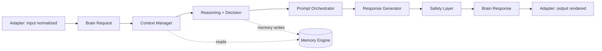

# Sprint 5 — 01 · Brain PRD (Product Requirements: The Aura Brain)

> Status: **ARCHITECTURE DRAFT** · Scope: design only · No implementation authorized.

## Purpose

The Aura Brain is the provider-agnostic cognitive core of Aura. It is the single component
responsible for *thinking, remembering, reasoning, and deciding what to say* — independent of
how words arrive or leave the system. Speech, telephony, transcription, synthesis, and model
vendors are **adapters**; the Brain never depends on them.

The Brain exists so that Aura's intelligence can evolve, scale, and be replaced part-by-part
without rewriting the product, and without leaking vendor concepts (LiveKit, STT, TTS,
Cartesia, OpenAI, Gemini) into cognition.

## Product Goals

1. **Provider independence** — cognition is defined by structured input/output contracts, not
   by any vendor SDK. Any model or transport can be swapped behind an adapter.
2. **Continuity of relationship** — Aura remembers people, preferences, history, and emotional
   context across sessions, forming a persistent relationship rather than stateless chat.
3. **Deterministic orchestration** — every response is produced by an auditable pipeline of
   named engines, not a single opaque prompt.
4. **Safety by construction** — a dedicated safety layer can veto, redact, or reshape any output
   before it leaves the Brain.
5. **Scale to millions** — every engine is horizontally scalable, independently replaceable, and
   free of shared mutable global state.

## Non-Goals

- Not a transport layer (no audio, no sockets, no telephony).
- Not a model provider (owns no weights; calls models only through adapters).
- Not a UI. Not a database engine. Not an auth system.
- No business/billing logic inside cognition.

## Personas & Primary Use Cases

| Persona | Need the Brain serves |
|---------|-----------------------|
| End user | A consistent, emotionally aware companion that remembers them |
| Product | A stable cognition contract that survives vendor churn |
| Platform/DevOps | Independently scalable engines with clear failure boundaries |
| Safety/Trust | A mandatory checkpoint that can override any generated content |
| Future engineers | Replaceable modules behind documented interfaces |

## Functional Requirements (What the Brain must do)

- Accept a **structured turn request** (who is speaking, what they expressed, session and
  relationship identifiers, situational signals) and return a **structured turn response**
  (intended message, emotional tone, actions/tool intents, memory updates, safety verdict).
- Maintain layered memory (working, episodic, semantic, relationship, preference, conversation).
- Model a stable personality and a dynamic emotional state per relationship.
- Reason over context and decide *what* to do (respond, ask, recall, act, defer, refuse).
- Orchestrate prompt construction from many context sources deterministically.
- Enforce safety on every output.
- Emit events describing everything it did, for observability and learning.

## Non-Functional Requirements

| Attribute | Target/Principle |
|-----------|------------------|
| Latency | Pipeline budgeted per stage; slow optional stages degrade gracefully |
| Scalability | Stateless compute + externalized state; shard by relationship |
| Replaceability | Each engine hidden behind a versioned interface |
| Observability | Every decision emits a traceable event |
| Determinism | Same inputs + same config version → reproducible orchestration path |
| Privacy | Memory scoped per user/relationship; forgettable on request |
| Portability | No vendor type ever crosses a Brain interface boundary |

## Inputs

- A single **BrainRequest** contract: identity references, structured user input (already
  transcribed/normalized by an adapter), session context, relationship reference, situational
  signals, and a brain configuration version.

## Outputs

- A single **BrainResponse** contract: response intent and content, emotional/personality
  framing, tool/action intents, memory-write proposals, safety verdict, and trace metadata.

## Dependencies

- Downstream: model access, vector store, and durable state stores — **all via adapters**.
- Internal: the engines defined in documents 03–13.
- Consumers: transport/session adapters (out of Brain scope) that translate audio/text.

## Data Flow (high level)

## Failure Cases

- **Missing context store** → Brain runs in degraded "cold" mode (personality + safety only),
  clearly flagged in the response trace.
- **Model adapter timeout** → fallback to a shorter deterministic response path.
- **Safety veto** → response replaced with a safe alternative; event emitted.
- **Corrupt/oversized input** → rejected at the contract boundary before cognition.

## Future Scaling

- Per-relationship sharding of memory and state.
- Independent autoscaling of heavy engines (Reasoning, Knowledge) vs light engines (Emotion).
- Multi-region memory with locality routing.
- Offline reflection/learning jobs decoupled from the live turn path.

## Interfaces (contracts, not code)

- `BrainRequest` / `BrainResponse` — the only public contract (see 14-Brain-API-Contracts).
- Every engine exposes a small, named capability contract consumed only through the Event Bus
  or the Context Manager, never by direct vendor calls.

## Related Documents

02 (System Architecture) · 03 (Module Architecture) · 13 (Safety) · 14 (API Contracts).
