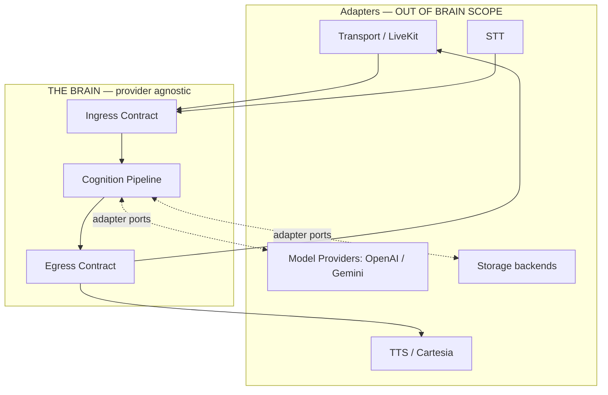
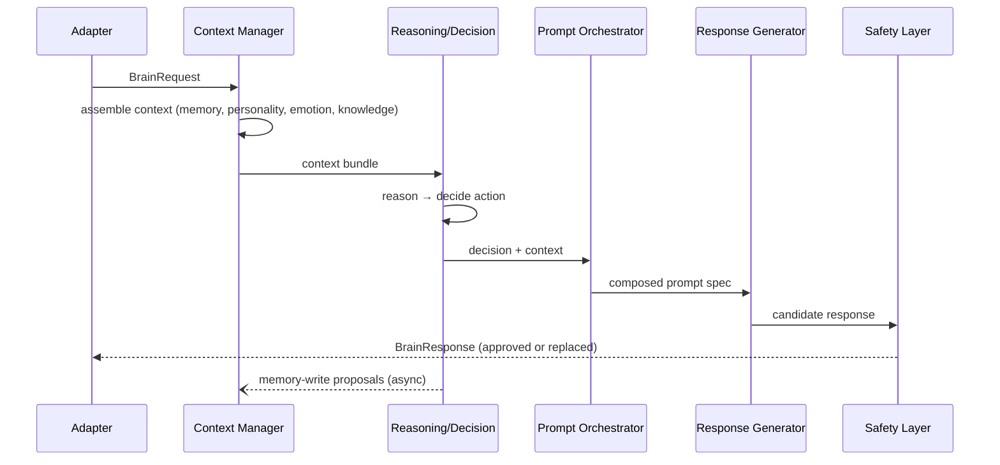

# Sprint 5 — 02 · Brain System Architecture

> Status: **ARCHITECTURE DRAFT** · Scope: design only.

## Purpose

Define the top-level shape of the Brain: its boundary, its internal layers, how a single "turn"
flows through it, and the rule that keeps it independent from every external provider.

## The Boundary Rule

The Brain has exactly **one entry** (accept a structured request) and **one exit** (return a
structured response). Everything vendor-specific lives *outside* this boundary in adapters.

## Layered Architecture

| Layer | Members (docs) | Role |
|-------|----------------|------|
| **Ingress/Egress** | Contracts (14), Input Safety (18) | Validate, screen, and shape the only public interface |
| **Orchestration** | Context Manager (08), Prompt Orchestrator (10), State Manager (11) | Coordinate the turn |
| **Cognition** | Reasoning, Decision (07), Personality (05), Emotion (06), Goal, Planner | Decide what to do |
| **Knowledge & Memory** | Memory Engine (04), Knowledge Engine (12) | Recall and ground |
| **Generation** | Response Generator, Prompt Orchestrator (10) | Produce candidate output |
| **Governance** | Safety Layer (13), Reflection Engine (19) | Guard and improve |
| **Platform** | Event Bus, Configuration, Versioning (03), Cost/Latency Controller (20) | Cross-cutting fabric |

## Responsibilities

- Own the canonical turn lifecycle (see 09-Conversation-Lifecycle).
- Coordinate engines through the Event Bus and Context Manager — never direct provider calls.
- Guarantee that no vendor type crosses the boundary.
- Provide deterministic, versioned orchestration.

## Inputs

- `BrainRequest` (from any adapter).
- Brain Configuration (active version) and relationship/session references.

## Outputs

- `BrainResponse` (to any adapter).
- A stream of Brain Events (observability, learning, audit).

## Dependencies

- **Ports (adapter interfaces), not implementations:** Model Port, Vector Port, Memory Store
  Port, Clock Port, Config Port. Each is satisfied by an external adapter.

## Data Flow (turn, detailed)

## Failure Cases

- Any engine unavailable → Context Manager substitutes a documented default and marks the trace
  as degraded; the turn still completes.
- Event Bus backpressure → non-critical events buffered/dropped by policy; critical path
  unaffected.
- Config version mismatch → request rejected with a clear contract error.

## Future Scaling

- Each layer scales independently; cognition and generation are the hot paths.
- Stateless compute nodes; all state in externalized stores keyed by relationship.
- Regional Brain instances share memory via replication, not shared process state.

## Interfaces

- **Public:** one ingress + one egress contract (14).
- **Internal:** Context Manager API and Event Bus topics (03).
- **Ports:** Model/Vector/Store/Clock/Config — all provider-agnostic.

## Related Documents

01 (PRD) · 03 (Modules) · 08 (Context) · 10 (Orchestrator) · 13 (Safety) · 14 (Contracts).
