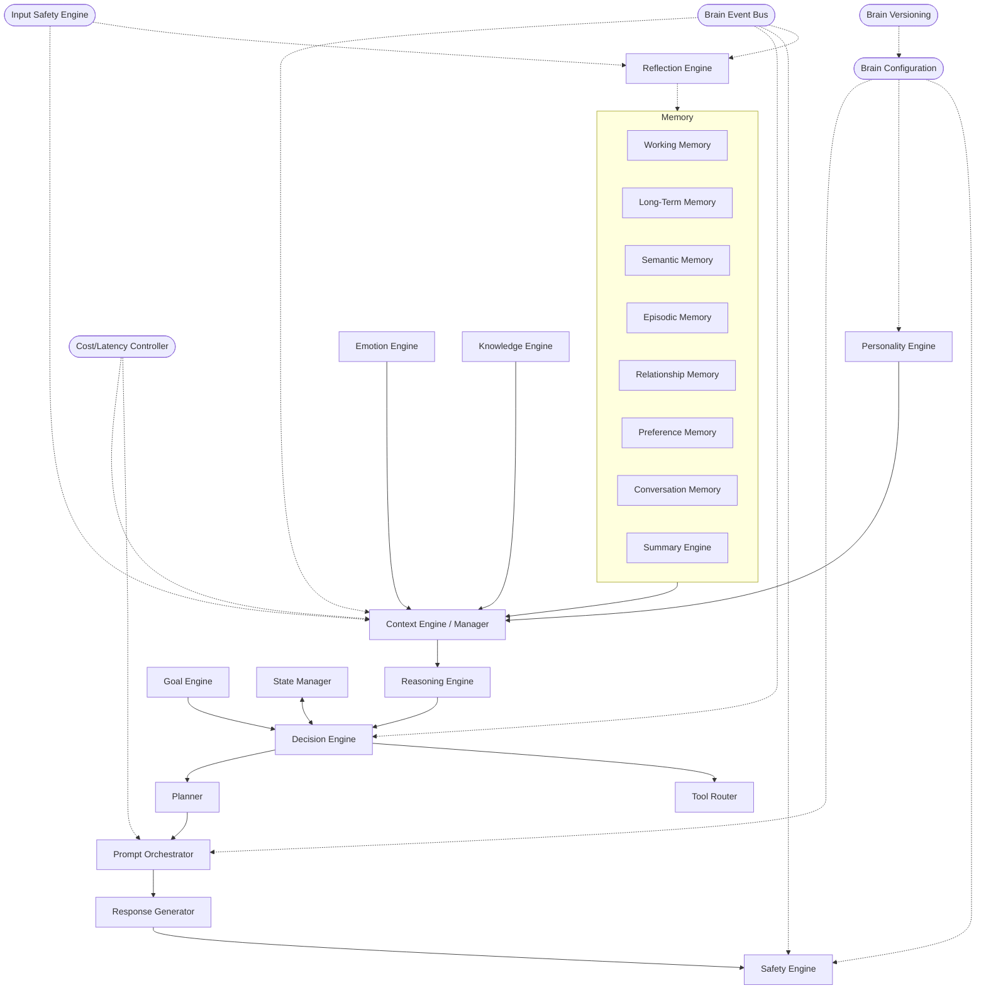

# Sprint 5 — 03 · Brain Module Architecture

> Status: **ARCHITECTURE DRAFT** · Scope: design only.

## Purpose

Enumerate every Brain module, its role, and how modules relate — so each can be built,
versioned, and replaced independently behind a stable interface.

## Module Map

## Module Registry

| Module | Doc | One-line responsibility |
|--------|-----|-------------------------|
| Memory Engine (umbrella) | 04 | Own all memory tiers + retrieval |
| Working Memory | 04 | Hold the live turn's short-term state |
| Long-Term Memory | 04 | Durable facts across sessions |
| Semantic Memory | 04 | Meaning/embedding-based recall |
| Episodic Memory | 04 | Time-ordered events ("what happened") |
| Relationship Memory | 04 | Per-person bond, history, dynamics |
| Preference Memory | 04 | Stable likes/dislikes/settings |
| Conversation Memory | 04 | Current + recent dialogue turns |
| Summary Engine | 04 | Compress history into recallable summaries |
| Context Engine/Manager | 08 | Assemble the per-turn context bundle |
| Personality Engine | 05 | Stable traits, voice, values |
| Emotion Engine | 06 | Dynamic affective state + appraisal |
| Reasoning Engine | 07 | Interpret situation, infer intent |
| Decision Engine | 07 | Choose the action for the turn |
| Goal Engine | 07 | Track short/long-term objectives |
| Planner | 07 | Sequence multi-step actions |
| Prompt Orchestrator | 10 | Deterministically compose prompt specs |
| Knowledge Engine | 12 | Ground responses in facts/retrieval |
| Tool Router | 12 | Map action intents to tool contracts |
| Response Generator | 10 | Turn a prompt spec into candidate output |
| Safety Engine | 13 | Veto/redact/reshape any output |
| Reflection Engine | 19 | Post-turn learning + memory consolidation (off live path) |
| Input Safety Engine | 18 | Screen ingress + gate memory writes (injection/poisoning defense) |
| Cost/Latency Controller | 20 | Own token/cost/time budgets + central retry policy |
| State Manager | 11 | Own agent/session state transitions |
| Brain Event Bus | 03 | Decoupled internal messaging |
| Brain Configuration | 03 | Versioned knobs for all engines |
| Brain Versioning | 03 | Pin behavior to reproducible versions |

## Cross-Cutting Modules (defined here)

### Brain Event Bus
- **Purpose:** decouple engines; every significant action becomes an event.
- **Inputs:** typed events from any engine. **Outputs:** delivery to subscribers.
- **Failure:** backpressure policy; critical vs droppable topics.
- **Interface:** publish(topic, event) / subscribe(topic) — capability contract only.
- **Delivery semantics (defined):**
  - **Topic classes:** `critical` (e.g., turn record for Reflection, safety incidents, state
    transitions) vs `droppable` (fine-grained telemetry).
  - **Guarantee:** `critical` topics are **at-least-once** with durable persistence and
    acknowledged delivery; `droppable` topics are best-effort and may be shed under backpressure.
  - **Ordering:** per-key ordered (keyed by relationship/session); no global ordering assumed.
  - **Idempotency:** every event carries an event id + trace id; consumers must be idempotent
    (redelivery applied once). This is why Reflection (19) consolidation is idempotent.
  - **Dead-letter:** un-consumable `critical` events are dead-lettered for replay, never silently
    dropped — closing the "silent memory rot" risk.
  - **Distribution:** moving from in-process to a distributed broker preserves these semantics; the
    contract is delivery-class + ordering-key, not the transport.

### Brain Configuration
- **Purpose:** single source of tunable behavior (personality baselines, safety thresholds,
  context budgets), addressable by version.
- **Inputs:** active config version. **Outputs:** resolved settings per engine.
- **Failure:** unknown version → reject; missing key → documented default.

### Brain Versioning
- **Purpose:** make cognition reproducible; a response can be traced to exact engine + config
  versions.
- **Inputs:** version selectors. **Outputs:** pinned behavior set.
- **Failure:** version drift detection; incompatible-version rejection.

## Responsibilities (module system as a whole)

- Keep modules independently replaceable via versioned interfaces.
- Route all inter-module communication through the Event Bus or Context Manager.
- Prevent any hidden coupling to providers.

## Inputs / Outputs / Dependencies

- **Inputs:** `BrainRequest`, config version.
- **Outputs:** `BrainResponse`, Brain Events.
- **Dependencies:** ports (Model/Vector/Store/Clock/Config).

## Data Flow

See the Module Map above and 09-Conversation-Lifecycle for the temporal ordering.

## Failure Cases

- A missing module resolves to its documented default behavior.
- Interface version mismatch is a hard, explicit error (never silent).

## Future Scaling

- Modules deploy as independently scalable units.
- Heavy modules (Reasoning, Knowledge, Summary) scale separately from light ones.
- Event Bus can move from in-process to distributed without changing module contracts.

## Interfaces

- Each module exposes a minimal named capability contract; consumers depend on the contract and
  version, never the implementation.

## Related Documents

02 (System) · 04 (Memory) · 07 (Decision) · 08 (Context) · 11 (State) · 14 (Contracts).
