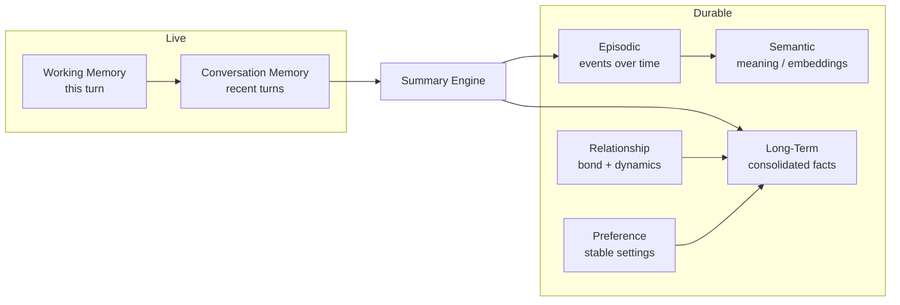
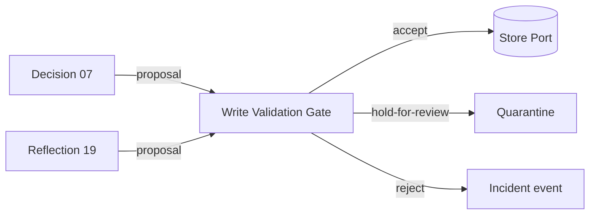
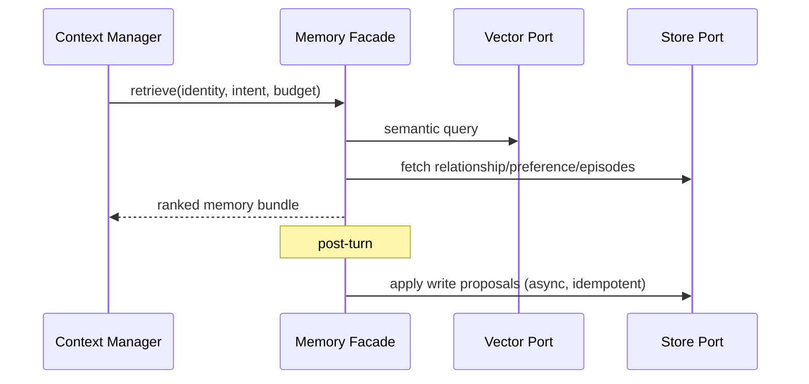

# Sprint 5 — 04 · Memory Architecture

> Status: **ARCHITECTURE DRAFT** · Scope: design only.

## Purpose

Define how Aura remembers. Memory is the foundation of relationship continuity: it lets Aura
recall who someone is, what happened, what they prefer, and how the bond has evolved — across
sessions and at scale. Memory is a set of cooperating tiers behind one retrieval facade.

## Memory Tiers

### Working Memory
- **Purpose:** ephemeral scratchpad for the current turn (active entities, focus, pending
  intents). **Lifetime:** one turn. **Failure:** never persisted; loss is harmless.

### Conversation Memory
- **Purpose:** the recent dialogue window. **Outputs:** ordered recent turns to Context.
- **Failure:** truncation policy when window exceeds budget → oldest turns summarized.

### Episodic Memory
- **Purpose:** "what happened and when" — time-ordered significant events.
- **Outputs:** recallable episodes by time/topic. **Failure:** gaps tolerated; never fabricated.

### Semantic Memory
- **Purpose:** meaning-based recall via vector similarity (through the Vector Port).
- **Outputs:** relevant memories for a query. **Failure:** empty result → Context degrades, not errors.

### Relationship Memory
- **Purpose:** the persistent model of the bond with a specific person (history, tone, trust,
  milestones). **Outputs:** relationship frame for Personality/Emotion.

### Preference Memory
- **Purpose:** stable, explicit likes/dislikes/settings. **Outputs:** constraints/hints to Decision.

### Long-Term Memory
- **Purpose:** consolidated durable facts distilled from episodes + summaries.

### Summary Engine
- **Purpose:** compress conversation and episodes into compact, faithful summaries to keep
  context within budget. **Failure:** must never invent; low-confidence → keep raw + flag.

## Responsibilities

- Store, index, retrieve, and forget memories, scoped per user/relationship.
- Provide one **retrieval facade** to the Context Manager (tiers are internal detail).
- Support consolidation (via Reflection) and deletion (privacy) on request.
- Route **every write** through the Memory-Write Validation Gate before persistence.

## Memory-Write Validation Gate

No memory is persisted directly. Every write proposal — from Decision (07) or Reflection (19) —
passes through a validation gate owned jointly with the Input Safety Engine (18). This closes the
**memory-poisoning** threat.

- **Trust check:** proposals derived from `untrusted` content (18 trust tags) cannot become
  high-confidence durable facts without corroboration.
- **Contradiction check:** a proposal that conflicts with an existing high-confidence memory is
  held for review, not silently overwritten.
- **Provenance required:** every persisted item carries source + confidence + trust level.
- **Idempotency:** writes keyed by (relationship, proposal id); redelivery applies once.
- **Verdict:** accept / hold-for-review / reject, each emitting an event for audit + Reflection.

## Embedding Versioning & Reindex Strategy

Semantic Memory depends on the Vector Port; embedding models change over time. To keep recall
consistent at scale:

- Every stored vector carries an **embedding-model version** tag.
- Retrieval never mixes vectors across incompatible embedding versions; queries are embedded with
  the version pinned in the active Brain Configuration.
- A **rolling reindex** job (offline, off the live path) re-embeds cold vectors to a new version
  in the background; dual-read during migration serves both versions until cutover.
- Reindex progress is observable via events; cutover is a Configuration version change, never a
  silent switch. No live turn is blocked by reindexing.

## Memory Retention Policy

Retention is a design-time contract, not an implementation afterthought (closes review risk R2):

| Tier | Default retention | Decay / promotion |
|------|-------------------|-------------------|
| Working | One turn | Discarded immediately |
| Conversation | Rolling recent window | Oldest turns summarized into Episodic |
| Episodic | Time-bounded, significance-weighted | Low-significance events decay; salient ones promote to Long-Term |
| Semantic | Follows source tier | Re-embedded on version change; orphans pruned |
| Relationship / Preference | Durable until forgotten | Refreshed by Reflection; no automatic decay |
| Long-Term | Durable, consolidated | Periodic compaction; superseded facts tombstoned |
| Summary | Follows summarized source | Regenerated when source window shifts |

- **Promotion/demotion** runs as an offline Reflection (19) pass, coordinated with tiered storage.
- **Right-to-forget** always wins over retention: deletion is a hard delete + tombstone.

## Inputs

- Memory-write proposals from Decision/Reflection.
- Retrieval queries from the Context Manager (identity + intent + budget).

## Outputs

- A ranked, budgeted **memory bundle** per turn.
- Write/consolidation acknowledgements and events.

## Dependencies

- **Vector Port** (semantic search), **Store Port** (durable state), **Clock Port** (time),
  Summary Engine, Reflection Engine. All provider-agnostic.

## Data Flow

## Failure Cases

- Vector/Store unavailable → return partial bundle; mark degraded.
- Write conflict → idempotent, last-writer-wins by versioned timestamp; event emitted.
- Over-budget recall → rank and trim; never overflow the context budget.
- Privacy deletion → hard delete + tombstone so recall cannot resurrect it.

## Future Scaling

- Shard by relationship key; hot relationships cached in fast tiers.
- Tiered storage: recent = fast, cold = cheap; automatic promotion/demotion.
- Consolidation runs as offline batch jobs, off the live path.
- Multi-region replication with locality-aware reads.

## Interfaces (contracts, not code)

- **Retrieval facade:** accepts (identity, intent, budget) → returns ranked memory bundle.
- **Write facade:** accepts memory-write proposals → returns acknowledgement + event.
- **Forget facade:** accepts a deletion scope → returns confirmation.

## Related Documents

08 (Context) · 07 (Decision) · 17 (Reflection notes) · 14 (Contracts).
