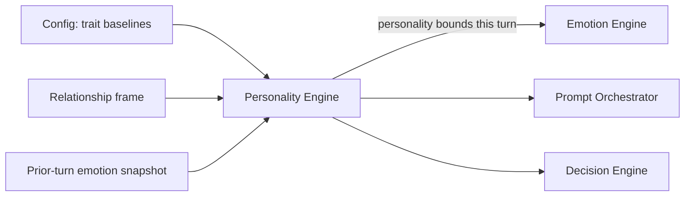

# Sprint 5 — 05 · Personality Engine

> Status: **ARCHITECTURE DRAFT** · Scope: design only.

## Purpose

Give Aura a stable, recognizable self: consistent traits, values, voice, and boundaries that
persist across turns and sessions, while remaining configurable and versionable. Personality is
the *slow-moving* identity layer, distinct from the *fast-moving* Emotion Engine.

## Responsibilities

- Hold the baseline trait profile (e.g., warmth, curiosity, playfulness, directness) as
  configuration, not hardcoded behavior.
- Provide a **personality frame** each turn that shapes tone, phrasing, and value alignment.
- Enforce identity boundaries (what Aura will and won't role-play or claim to be).
- Blend with the current relationship frame so Aura adapts *how* it expresses its stable self to
  each person, without changing *who* it is.
- Stay versioned so personality changes are deliberate and reproducible.

## Inputs

- Brain Configuration (active personality version + trait baselines).
- Relationship frame (from Relationship Memory).
- **Prior-turn** emotional snapshot (from Emotion Engine) for modulation, not identity change.

> **Dependency direction (acyclic).** Personality is computed **before** Emotion within a turn
> (see 08 Context Assembly DAG). It consumes only the *previous* turn's emotional snapshot — a
> stored value, not a live call — and it emits static personality *bounds* that Emotion reads this
> turn. There is therefore no runtime cycle: Personality → (bounds) → Emotion in the current turn;
> Emotion → (snapshot) → Personality only across the turn boundary.

## Outputs

- A **personality frame**: tone directives, voice/style guidance, value constraints, and
  boundary rules — consumed by the Prompt Orchestrator and Decision Engine.

## Dependencies

- Brain Configuration + Versioning, Relationship Memory, Emotion Engine (read-only, **prior-turn
  snapshot only** — no live/in-turn call, preserving an acyclic direction).

## Data Flow

## Failure Cases

- Missing personality config → fall back to a documented safe default persona; flag trace.
- Conflict between emotion and identity boundary → identity boundary wins (emotion may color
  tone but cannot break persona/values).
- Personality version mismatch → reject rather than silently mix versions.

## Future Scaling

- Multiple named personas selectable per product surface, all versioned.
- Per-relationship personality *adaptation profiles* layered over one stable core.
- A/B evaluation of persona versions via the Event Bus + Reflection metrics.

## Interfaces (contracts, not code)

- **Frame request:** accepts (config version, relationship frame, emotion snapshot) → returns a
  personality frame.
- **Boundary check:** accepts a proposed expression → returns allow / adjust / deny with reason.

## Related Documents

06 (Emotion) · 10 (Prompt Orchestrator) · 07 (Decision) · 13 (Safety) · 14 (Contracts).
