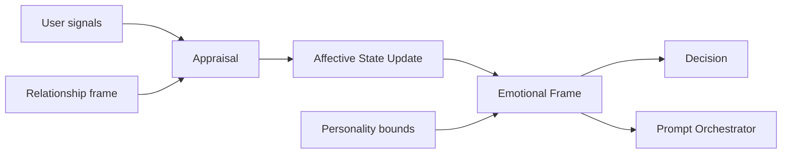

# Sprint 5 — 06 · Emotion Engine

> Status: **ARCHITECTURE DRAFT** · Scope: design only.

## Purpose

Model Aura's dynamic affective state and appraise the user's emotional signals, so responses are
emotionally appropriate. Emotion is the *fast-moving* layer that colors expression without
altering the stable personality (05).

## Responsibilities

- **Appraise** incoming signals (expressed sentiment, situational cues) into an emotional read of
  the user.
- **Maintain** Aura's own affective state per relationship, evolving smoothly over time (no
  abrupt whiplash).
- **Produce** an emotional frame that modulates tone, pacing, and empathy strategy.
- **Regulate** intensity so emotion never overrides safety or identity boundaries.

## Inputs

- Structured user signals from the request (already normalized by adapters, trust-tagged by 18).
- Relationship frame + recent conversation memory (for continuity).
- Personality **bounds** produced earlier **this turn** (Personality runs before Emotion; see 08
  Context Assembly DAG). These are read-only limits on emotional range.

> **Dependency direction (acyclic).** Emotion depends on Personality bounds computed earlier in
> the same turn, and exposes only a stored emotional *snapshot* that Personality reads on the
> *next* turn. No live call flows Emotion → Personality within a turn, so there is no cycle.

## Outputs

- An **emotional frame**: current affect, appraised user affect, empathy strategy, and intensity
  — consumed by Personality, Decision, and the Prompt Orchestrator.
- Emotion events for observability and Reflection.

## Dependencies

- Relationship Memory, Conversation Memory, Personality Engine (read-only **bounds** computed
  earlier in the same turn), Brain Configuration.

## Data Flow

## Failure Cases

- Ambiguous/absent signals → default to neutral-warm; never assume a strong emotion.
- Rapid oscillation → smoothing/inertia prevents unstable state.
- Emotion vs safety conflict → safety wins; emotion is advisory only.
- Emotion vs identity conflict → personality boundary wins.

## Future Scaling

- Richer appraisal models swapped behind the same emotional-frame contract.
- Per-relationship emotional memory to model long-term mood trends.
- Culture/locale-aware appraisal profiles as configuration.

## Interfaces (contracts, not code)

- **Appraise:** accepts (user signals, relationship frame) → returns appraised user affect.
- **State update:** accepts (appraisal, prior state) → returns new affective state.
- **Frame request:** returns the emotional frame for the turn.

## Related Documents

05 (Personality) · 07 (Decision) · 08 (Context) · 13 (Safety) · 14 (Contracts).
