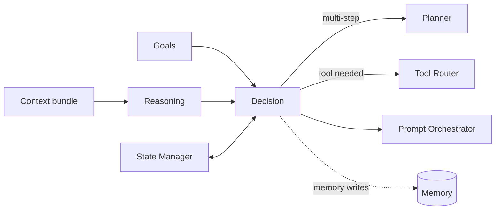

# Sprint 5 — 07 · Decision Engine (with Reasoning, Goals & Planner)

> Status: **ARCHITECTURE DRAFT** · Scope: design only.

## Purpose

Decide *what Aura should do* on each turn. This document covers the tightly related cognitive
core: the **Reasoning Engine** (interpret), the **Goal Engine** (why), the **Planner**
(sequence), and the **Decision Engine** (choose). Generation of the actual words happens later
(10); here we choose the action.

## Responsibilities

- **Reasoning Engine:** interpret the assembled context — infer user intent, needs, subtext, and
  situation; surface relevant considerations.
- **Goal Engine:** track short-term (this conversation) and long-term (relationship) objectives
  and keep them consistent.
- **Planner:** when an action requires multiple steps or tools, produce an ordered plan.
- **Decision Engine:** select exactly one action archetype for the turn (respond, ask/clarify,
  recall, invoke tool, defer, or refuse) with a rationale.

## Inputs

- Context bundle from the Context Manager (memory + personality + emotion + knowledge).
- Active goals and agent state (from Goal Engine + State Manager).
- Configuration (decision policy version).

## Outputs

- A **decision object**: chosen action archetype, target/parameters, referenced memories,
  proposed memory writes, and a rationale trace.
- Optional **plan** (ordered steps) for multi-step actions.
- Tool intents (handed to the Tool Router, 12).

## Dependencies

- Context Manager (08), Goal Engine, State Manager (11), Memory (04), Knowledge (12),
  Configuration/Versioning.

## Data Flow

## Failure Cases

- Insufficient context/confidence → choose "ask/clarify" rather than guess.
- Goal conflict → Goal Engine resolves by priority policy; unresolved → defer + flag.
- Planner cannot form a valid plan → downgrade to a single safe action.
- Requested action violates safety/identity → Decision must not select it; choose safe alternative.

## Future Scaling

- Pluggable reasoning strategies (fast heuristic vs deliberate) behind one decision contract.
- Parallel candidate decisions with a selection policy.
- Long-horizon goal tracking persisted in Relationship Memory.

## Interfaces (contracts, not code)

- **Reason:** accepts context bundle → returns interpretation.
- **Decide:** accepts (interpretation, goals, state) → returns decision object.
- **Plan:** accepts a decision needing steps → returns an ordered plan.

## Related Documents

08 (Context) · 10 (Orchestrator) · 11 (State) · 12 (Knowledge/Tools) · 13 (Safety) · 14 (Contracts).
