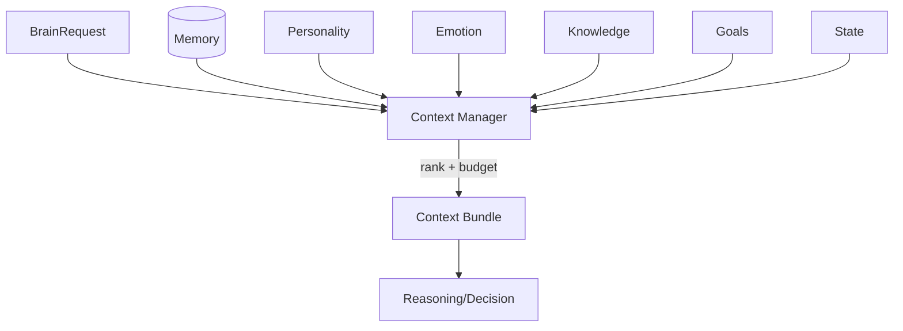
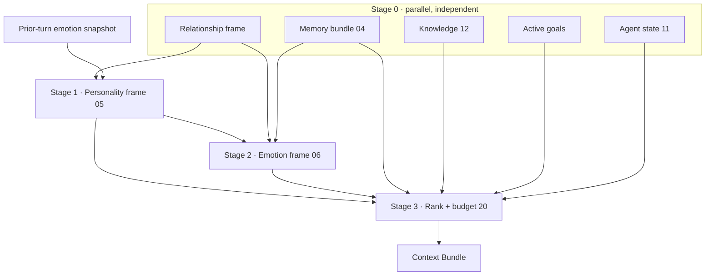

# Sprint 5 — 08 · Context Manager (Context Engine)

> Status: **ARCHITECTURE DRAFT** · Scope: design only.

## Purpose

Assemble the single **context bundle** that cognition reasons over each turn. The Context Manager
is the Brain's librarian: it gathers from every source (memory tiers, personality, emotion,
knowledge, goals, state), ranks by relevance, and fits everything within a strict budget.

## Responsibilities

- Orchestrate retrieval across Memory (04), Personality (05), Emotion (06), Knowledge (12),
  Goals and State (11).
- **Rank and budget:** select the most relevant items and trim to a configured context budget.
- Normalize everything into one provider-agnostic bundle for downstream engines.
- Guarantee graceful degradation when any source is missing.

## Inputs

- `BrainRequest` (identity, user input, session/relationship references).
- Configuration (context budget, ranking policy version).

## Outputs

- A **context bundle**: relationship frame, personality frame, emotional frame, relevant
  memories, grounded knowledge, active goals, and agent state — all ranked and budgeted.

## Dependencies

- Memory facade (04), Personality (05), Emotion (06), Knowledge (12), Goal Engine, State Manager
  (11), Configuration.

## Data Flow

## Context Assembly DAG (deterministic ordering)

The Context Manager assembles sources as an explicit **directed acyclic graph**, not an
unordered fan-out. Independent sources are gathered in parallel (timeout-bounded); dependent
frames are computed in strict order so there is never an intra-bundle cycle or race.

- **Stage 0** (parallel): Relationship, Memory, Knowledge, Goals, State — no interdependency.
- **Stage 1**: Personality frame (reads Relationship + prior-turn emotion snapshot).
- **Stage 2**: Emotion frame (reads Personality bounds from Stage 1 — resolves the 05/06 order).
- **Stage 3**: rank + trim to the token/cost budget granted by the Cost/Latency Controller (20).

This ordering is pinned to the ranking-policy version, making bundle assembly reproducible and
free of the Personality/Emotion ambiguity noted in earlier drafts.

## Failure Cases

- A source times out → omit it, insert a documented default, mark the bundle degraded.
- Budget overflow → deterministic ranking + trimming; never overflow downstream.
- Empty memory (new relationship) → cold-start bundle (personality + safety only).
- Ranking policy version unknown → reject with a contract error.

## Future Scaling

- Parallel, timeout-bounded fan-out to sources.
- Caching of stable frames (personality/relationship) across turns.
- Adaptive budgets by surface (short for voice, larger for text).
- Pluggable ranking strategies behind one bundle contract.

## Interfaces (contracts, not code)

- **Assemble:** accepts (request, budget, policy version) → returns a context bundle.
- **Explain:** accepts a bundle → returns which sources contributed (for trace/audit).

## Related Documents

04 (Memory) · 05 (Personality) · 06 (Emotion) · 07 (Decision) · 10 (Orchestrator) · 12 (Knowledge).
