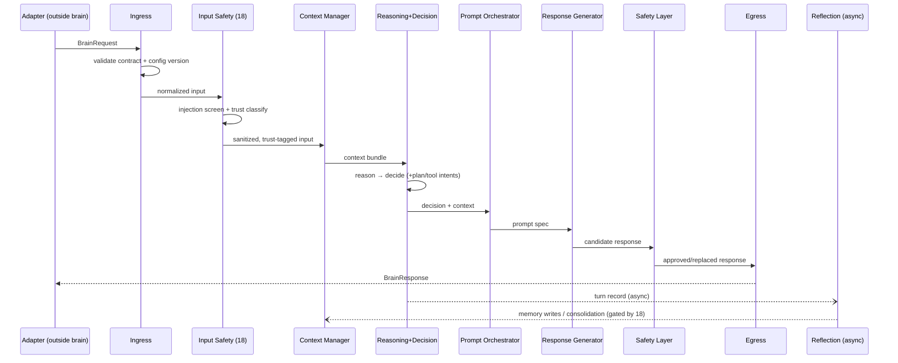

# Sprint 5 — 09 · Conversation Lifecycle

> Status: **ARCHITECTURE DRAFT** · Scope: design only.

## Purpose

Define the canonical order of a single turn from structured input to structured output, and how
turns compose into a conversation and a relationship. This is the temporal contract that ties
every engine together.

## The Turn Pipeline

## Lifecycle Scopes

| Scope | Spans | Owns |
|-------|-------|------|
| **Turn** | one request→response | Working Memory, this decision |
| **Conversation** | many turns in a session | Conversation Memory, session goals |
| **Relationship** | many conversations over time | Relationship/Preference/Long-Term Memory |

## Responsibilities

- Guarantee a fixed, auditable stage order every turn.
- Keep the live path synchronous only where required; push learning/consolidation to async.
- Emit lifecycle events at each stage boundary.

## Inputs / Outputs

- **Input:** `BrainRequest`. **Output:** `BrainResponse` + lifecycle events + async turn record.

## Dependencies

- Every engine; the Event Bus for stage events; Reflection for post-turn consolidation.

## Data Flow

See pipeline above. The only synchronous critical path is:
Ingress → Input Safety → Context → Decision → Orchestrator → Generator → Safety → Egress.
Memory consolidation and reflection are **off-path** (async). Per-stage deadlines are owned by the
Cost/Latency Controller (20); a stage that misses its deadline is skipped with a documented
default and a degraded flag.

## Failure Cases

- Timeout in an optional stage → skip with a default; still return a response.
- Safety veto at the last stage → substitute safe response; emit incident event.
- Ingress validation failure → immediate contract error, no cognition performed.
- Async reflection failure → retried; never blocks or corrupts the live turn.

## Future Scaling

- Streaming responses: stages emit partials while later turns are prepared.
- Speculative context assembly for likely next turns.
- Batched async consolidation across many relationships.

## Interfaces (contracts, not code)

- **Turn:** accepts `BrainRequest` → returns `BrainResponse` (the public lifecycle contract).
- **Lifecycle events:** stage-boundary events published to the Event Bus.

## Related Documents

02 (System) · 08 (Context) · 10 (Orchestrator) · 11 (State) · 13 (Safety) · 14 (Contracts).
