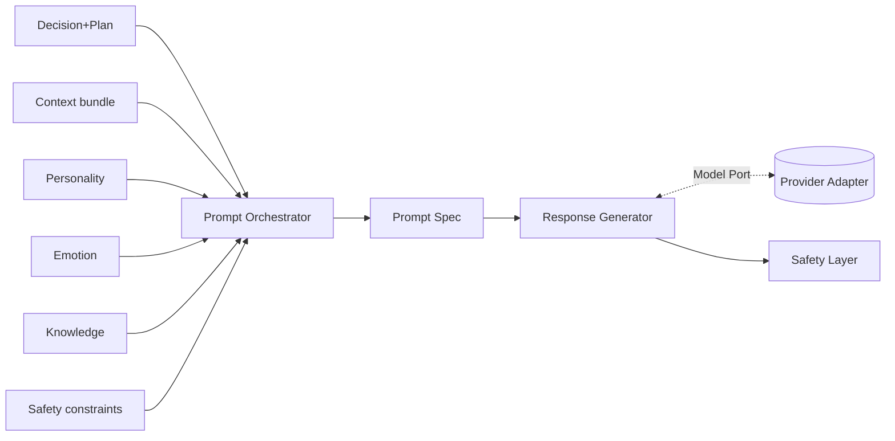

# Sprint 5 — 10 · Prompt Orchestrator (with Response Generator)

> Status: **ARCHITECTURE DRAFT** · Scope: design only.

## Purpose

Deterministically compose the instruction that produces Aura's words, then turn it into a
candidate response — without leaking any provider concept. The Orchestrator builds a
provider-agnostic **prompt spec** from many context sources; the **Response Generator** realizes
it via the Model Port.

## Responsibilities

### Prompt Orchestrator
- Assemble a structured **prompt spec** from: personality frame, emotional frame, decision +
  plan, relevant memory, grounded knowledge, and safety constraints.
- Apply deterministic templates/ordering pinned to a config version (reproducible).
- Respect the token/context budget from the Context Manager.
- Never embed vendor-specific formatting; the spec is neutral.

### Response Generator
- Translate the prompt spec into a model request **through the Model Port** (adapter).
- Return one or more candidate responses to the Safety Layer.
- Support deterministic fallback generation when the model is slow/unavailable.

## Inputs

- Decision object + plan (07), context bundle (08), personality/emotion frames (05/06),
  knowledge (12), configuration (prompt template version).

## Outputs

- **Prompt spec** (Orchestrator → Generator).
- **Candidate response(s)** (Generator → Safety), plus generation trace.

## Dependencies

- Model Port (adapter), Configuration/Versioning, Safety Layer (downstream), Context Manager.

## Data Flow

## Failure Cases

- Over-budget spec → deterministic trimming by section priority.
- Model Port timeout/error → fallback path (shorter, template-based) + degraded flag.
- Missing template version → reject; do not silently substitute.
- Empty/low-quality candidate → request one bounded retry, then safe fallback.

## Future Scaling

- Multiple candidates generated in parallel; selection policy picks the best.
- Streaming token output surfaced as partial responses.
- Per-surface prompt profiles (voice vs text) as configuration.
- Model routing (different adapters per task) behind the same Model Port.

## Interfaces (contracts, not code)

- **Compose:** accepts (decision, context, frames, constraints, version) → returns prompt spec.
- **Generate:** accepts prompt spec → returns candidate response(s) via Model Port.

## Related Documents

07 (Decision) · 08 (Context) · 05/06 (Personality/Emotion) · 12 (Knowledge) · 13 (Safety) · 14 (Contracts).
