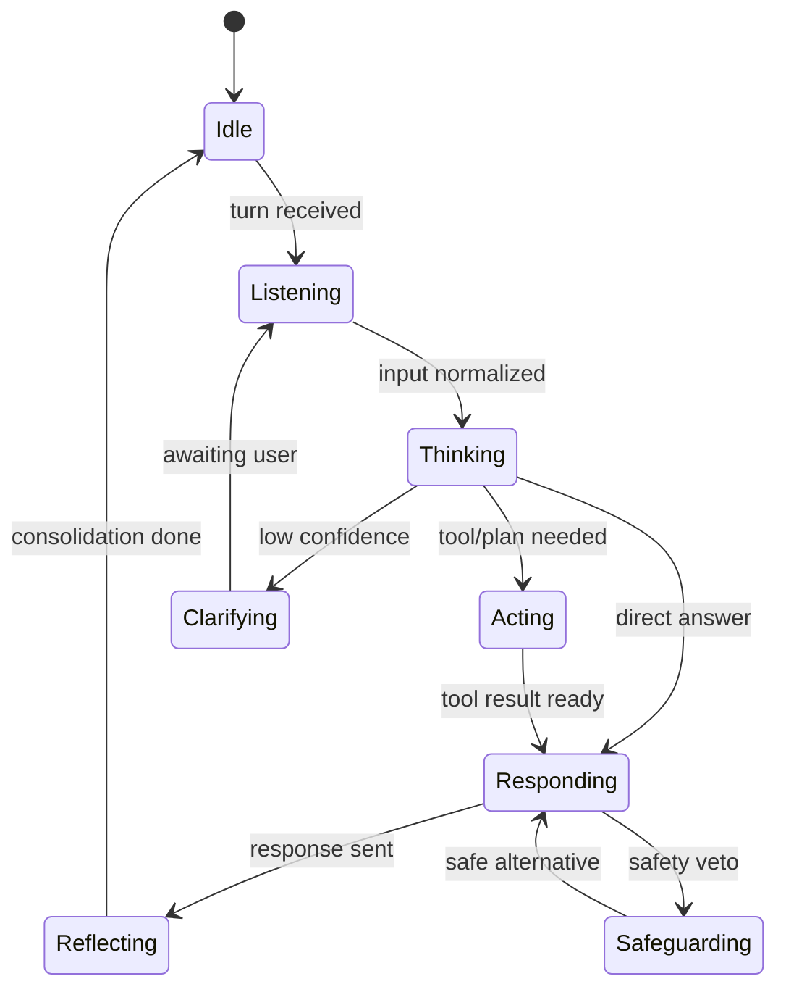
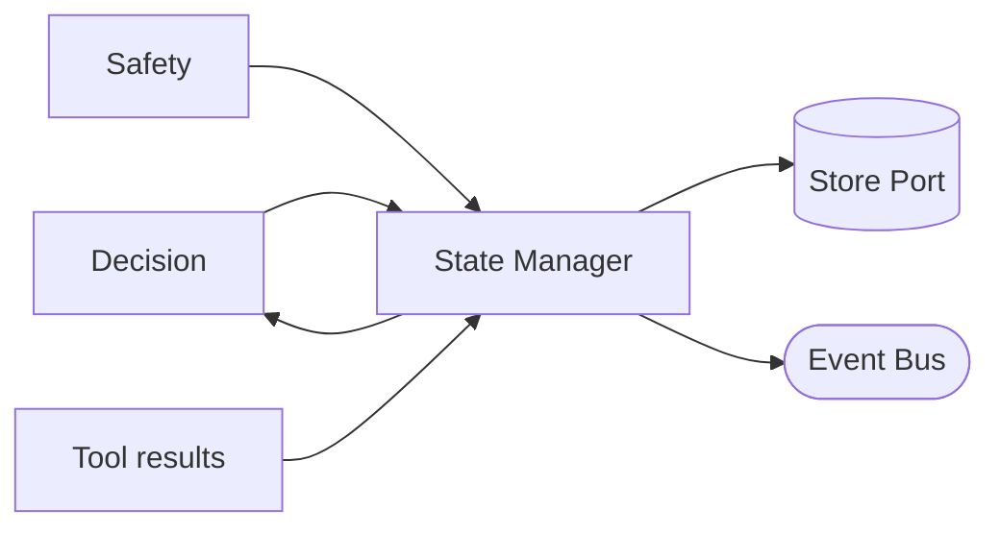

# Sprint 5 — 11 · Agent State Machine (State Manager)

> Status: **ARCHITECTURE DRAFT** · Scope: design only.

## Purpose

Own the explicit states an Aura agent moves through within a conversation, so behavior is
predictable, resumable, and auditable. The State Manager makes "where are we in this interaction"
a first-class, inspectable fact rather than implicit.

## Core States

## Responsibilities

- Define allowed states and legal transitions; reject illegal transitions.
- Persist state per session/relationship so a conversation can resume after interruption.
- Expose the current state to Decision (07) and the lifecycle (09).
- Emit a state-transition event for every change.

## Inputs

- Lifecycle stage signals, decision outcomes, tool results, safety verdicts.
- Persisted prior state (from Store Port) for resume.

## Outputs

- Current state + allowed next transitions.
- State-transition events (observability, audit).

## Dependencies

- Store Port (durable state), Event Bus, Decision Engine, Safety Layer.

## Data Flow

## Failure Cases

- Illegal transition requested → rejected; state unchanged; incident event emitted.
- Lost/corrupt persisted state → safe reset to Idle with a documented recovery note.
- Concurrent transitions → serialized per session key (single-writer discipline).
- Stuck state (timeout) → watchdog forces a safe transition and flags it.

## Future Scaling

- Per-relationship state sharding; single-writer per session key.
- Hierarchical states (conversation-level vs task-level) as an extension.
- Durable, replayable transition log for audit and learning.

## Interfaces (contracts, not code)

- **Transition:** accepts (current state, trigger) → returns next state or rejection.
- **Resume:** accepts session key → returns persisted state.
- **Inspect:** returns current state + legal next transitions.

## Related Documents

07 (Decision) · 09 (Lifecycle) · 13 (Safety) · 03 (Event Bus) · 14 (Contracts).
