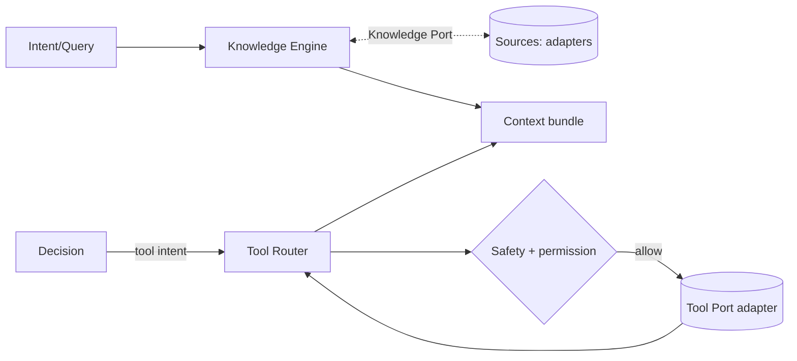

# Sprint 5 — 12 · Knowledge Engine (with Tool Router)

> Status: **ARCHITECTURE DRAFT** · Scope: design only.

## Purpose

Ground Aura's responses in facts and enable it to act through tools — without the Brain knowing
which concrete knowledge source or tool implementation is used. The **Knowledge Engine** retrieves
and validates grounding; the **Tool Router** maps action intents to abstract tool contracts.

## Responsibilities

### Knowledge Engine
- Retrieve relevant facts/documents for the current intent (through the Vector/Knowledge Port).
- Attach provenance and confidence to every grounded item.
- Prevent unsupported claims: if grounding is weak, signal "insufficient knowledge" to Decision.

### Tool Router
- Translate a Decision's tool intent into an abstract **tool contract** (name, inputs, expected
  outputs) and dispatch it via a Tool Port.
- Normalize tool results back into context-ready facts.
- Enforce per-tool permissions and safety constraints before dispatch.

## Multi-Tenant Isolation

At 10M-user scale, knowledge and tool access must be strictly partitioned so one user's data can
never surface for another.

- **Tenant scoping:** every knowledge query and vector search is scoped by tenant/relationship
  key; cross-tenant reads are impossible by construction, not by filtering after the fact.
- **Namespace per scope:** shared/global knowledge, per-tenant knowledge, and per-relationship
  knowledge are separate namespaces behind the Knowledge Port; results carry their scope.
- **Trust tagging:** retrieved items are trust-tagged (18) before entering context, so external
  knowledge is rendered as data, never as instructions.
- **Tool permissions are per-tenant:** the Tool Router enforces the caller's permission set; a
  tool a tenant is not entitled to is refused with an incident event.
- **No ambient authority:** engines never hold global credentials; all access is mediated by the
  port with the turn's identity references.

## Inputs

- Query/intent from Context Manager or Decision.
- Tool intents from the Decision Engine.
- Configuration (allowed tools, grounding thresholds).

## Outputs

- **Grounded knowledge** items (with provenance + confidence).
- **Tool results** normalized into facts, plus tool-invocation events.

## Dependencies

- Vector/Knowledge Port, Tool Port (adapters), Safety Layer, Configuration.

## Data Flow

## Failure Cases

- No/low-confidence grounding → return "insufficient" so Decision avoids hallucination.
- Tool unavailable/timeout → report failure as a fact; Decision chooses an alternative.
- Unpermitted tool requested → Router refuses; incident event emitted.
- Conflicting sources → surface conflict with provenance; do not silently pick one.

## Future Scaling

- Multiple knowledge backends behind one Knowledge Port (docs, graph, live data).
- Tool marketplace: new tools added as adapters without Brain changes.
- Caching of stable facts; freshness policy per source.
- Parallel retrieval with relevance fusion.

## Interfaces (contracts, not code)

- **Ground:** accepts (intent, threshold) → returns grounded items + provenance/confidence.
- **Route tool:** accepts a tool intent → returns normalized tool result or refusal.

## Related Documents

07 (Decision) · 08 (Context) · 13 (Safety) · 10 (Orchestrator) · 14 (Contracts).
