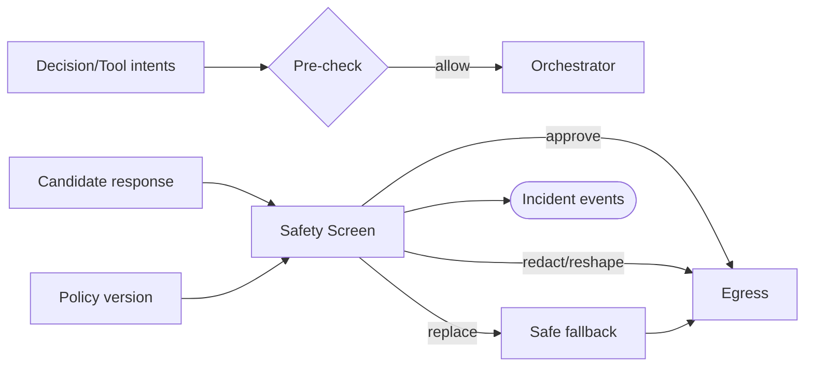

# Sprint 5 — 13 · Safety Layer (Safety Engine)

> Status: **ARCHITECTURE DRAFT** · Scope: design only.

## Purpose

Be the Brain's mandatory guardian: a checkpoint that can **veto, redact, or reshape** any output
before it leaves the boundary, and constrain what cognition is allowed to attempt. Safety is
non-optional and sits on the critical path — no response reaches an adapter without passing it.

## Responsibilities

- Provide **safety constraints** to upstream engines (Orchestrator, Decision) so unsafe paths are
  avoided early.
- **Screen** every candidate response: block disallowed content, redact sensitive data, and
  reshape tone/claims to policy.
- Enforce **identity and boundary** rules (what Aura must not claim, impersonate, or promise).
- Guarantee a **safe fallback** exists for every vetoed response.
- Emit safety incident events for audit and Reflection.

## Inputs

- Candidate response(s) from the Response Generator.
- Decision intents and tool intents (pre-screening).
- Configuration (safety policy version, thresholds, redaction rules).

## Outputs

- A **safety verdict**: approve / redact / reshape / replace, with reason codes.
- The final safe response (possibly substituted).
- Safety incident events.

## Dependencies

- Configuration/Versioning, Event Bus, Personality (identity boundaries), Tool Router
  (pre-dispatch checks).

## Data Flow

## Failure Cases

- Safety service itself unavailable → **fail closed**: emit a conservative safe response, never
  bypass screening.
- Ambiguous verdict → escalate to the most restrictive action.
- Policy version unknown → reject the turn rather than run unscreened.
- Redaction incomplete → replace entire response with safe fallback.

## Future Scaling

- Layered classifiers (fast pre-filter + deep screen) behind one verdict contract.
- Per-jurisdiction/policy packs as configuration versions.
- Human-in-the-loop escalation channel via the Event Bus for edge cases.
- Continuous policy evaluation using incident telemetry.

## Interfaces (contracts, not code)

- **Constrain:** returns active safety constraints for upstream engines.
- **Screen:** accepts candidate response + context → returns safety verdict + final safe output.
- **Pre-check:** accepts a decision/tool intent → returns allow/deny with reason.

## Related Documents

05 (Personality) · 07 (Decision) · 10 (Orchestrator) · 12 (Tools) · 09 (Lifecycle) · 14 (Contracts).
