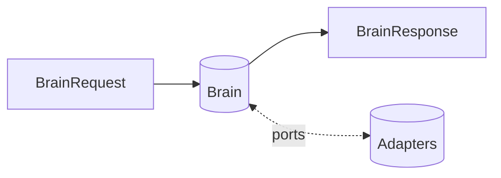

# Sprint 5 — 14 · Brain API Contracts

> Status: **ARCHITECTURE DRAFT** · Scope: design only. Contracts are described as **capabilities
> and field intent**, not as code, TypeScript, or SQL.

## Purpose

Define the single public boundary of the Brain and the internal contracts between engines, so any
adapter or engine can be replaced without breaking others. Contracts are conceptual shapes — the
authoritative, provider-agnostic vocabulary of the Brain.

## The Public Boundary

The Brain exposes exactly one capability: **process a turn**. Adapters convert audio/text/vendor
formats into the request and render the response.

### BrainRequest (conceptual)

| Field group | Intent |
|-------------|--------|
| Identity references | Who is speaking (user id, relationship id) — references, not PII payloads |
| User input | Already-normalized structured input (text + optional signals) from an adapter |
| Session context | Session id, surface (voice/text), locale |
| Situational signals | Optional cues (sentiment hints, environment) |
| Trace context | Trace id + parent span id for end-to-end distributed tracing |
| Config version | Which Brain behavior version to run |

### BrainResponse (conceptual)

| Field group | Intent |
|-------------|--------|
| Response content | The intended message (neutral form; adapter renders to voice/text) |
| Expression frame | Emotional/personality framing hints |
| Action intents | Tool/action requests for adapters to execute (if any) |
| Memory proposals | Reference to what will be remembered (applied async) |
| Safety verdict | Approve/redact/reshape/replace + reason codes |
| Accounting | Per-turn cost, tokens, and latency record (from 20) |
| Trace metadata | Trace id, versions, contributing sources, degraded flags |

## Internal Contracts (engine-to-engine)

| Contract | Producer → Consumer | Intent |
|----------|--------------------|--------|
| Context Bundle | Context Mgr → Reasoning/Decision | Ranked, budgeted context |
| Decision Object | Decision → Orchestrator | Chosen action + rationale |
| Plan | Planner → Orchestrator/Tool Router | Ordered steps |
| Prompt Spec | Orchestrator → Generator | Neutral instruction shape |
| Candidate Response | Generator → Safety | Pre-screening output |
| Safety Verdict | Safety → Egress | Final approval/replacement |
| Memory Bundle | Memory → Context Mgr | Recalled memories |
| Memory Write Proposal | Decision/Reflection → Memory | What to persist |
| Personality/Emotion Frame | 05/06 → Context/Orchestrator | Expression shaping |
| Grounded Knowledge | Knowledge → Context/Decision | Facts + provenance |
| Tool Contract | Tool Router → Tool Port | Abstract tool call |
| State Transition | State Mgr ↔ Decision | Agent state |
| Input-Safety Verdict | Input Safety (18) → Context/Memory | Screen verdict + trust tags |
| Memory-Write Verdict | Write Gate (04/18) → Memory | accept / hold / reject + reason |
| Budget Grant | Cost/Latency Controller (20) → Context/Orchestrator | token/cost/time allowance |
| Learning Signal | Reflection (19) → Configuration | quality/safety/latency feedback |
| Brain Event | any → Event Bus | Observability/learning |

## Ports (adapter interfaces)

| Port | Hides | Guarantee |
|------|-------|-----------|
| Model Port | OpenAI/Gemini/etc. | Neutral generate capability |
| Vector/Knowledge Port | Embedding/search vendor | Neutral semantic recall |
| Store Port | Database vendor | Durable keyed state |
| Tool Port | External tool/API | Abstract tool invocation |
| Clock Port | Time source | Testable time |
| Config Port | Config source | Versioned settings |
| Safety-Classifier Port | Injection/content classifier vendor | Neutral classification verdict |

## Cross-Cutting Contracts

### Trace Propagation

Every `BrainRequest` carries a **trace id** (and optional parent span id). Each engine and port
creates a child span and stamps its events with the trace id, so any decision can be reconstructed
end-to-end across engines, async Reflection, and the Event Bus. The trace id is echoed in
`BrainResponse` trace metadata and in every Brain Event.

### Health & Readiness

Every engine and port exposes a uniform **health/readiness** capability so the Context Manager and
Cost/Latency Controller can make degraded-mode decisions deterministically rather than by timeout
alone.

| Signal | Meaning |
|--------|---------|
| `ready` | Engine/port can serve requests now |
| `degraded` | Serving with reduced capability; callers may substitute defaults |
| `unavailable` | Not serving; callers apply documented fallback (graceful degradation) |

- Health is **pull (probe)** and **push (event)**: probes drive orchestration; state changes emit
  Brain Events.
- A `degraded`/`unavailable` dependency triggers the documented default in the owning engine and
  marks the turn trace degraded — the turn still completes.

## Responsibilities

- Keep the public boundary minimal and stable.
- Version every contract; consumers depend on version, not implementation.
- Forbid vendor types from ever appearing in any contract.

## Inputs / Outputs / Dependencies

- **Input:** `BrainRequest`. **Output:** `BrainResponse` + events.
- **Dependencies:** the ports above (all provider-agnostic).

## Data Flow

## Failure Cases

- Contract validation failure → reject at ingress with reason codes.
- Version incompatibility → explicit error; never silent coercion.
- Port failure → degraded response per the owning engine's policy.

## Future Scaling

- Additive, backward-compatible contract evolution via versioning.
- Streaming variants of the turn capability.
- Batch/administrative capabilities added as separate, versioned contracts.

## Interfaces

- **process-turn** (public). All others are internal, versioned capability contracts above.

## Related Documents

02 (System) · 03 (Modules) · 09 (Lifecycle) · 16 (Coding Standards) · every engine doc.
