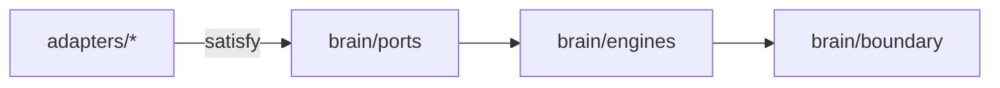

# Sprint 5 — 15 · Brain Folder Structure (Proposed)

> Status: **ARCHITECTURE DRAFT** · Scope: design only. This is a *proposed target layout* for a
> future implementation sprint — **not** an instruction to create files now. No code is authorized.

## Purpose

Propose where the Brain would live and how its modules map to folders, reinforcing independence
(each engine isolated, providers only in adapters).

## Guiding Rules

- The Brain is a **separate package/boundary** from transport and providers.
- One folder per engine; each engine owns its interface + internals.
- **Adapters live outside the Brain** and satisfy the ports (14).
- Nothing inside `brain/` may import a vendor SDK.

## Proposed Layout (conceptual, not created)

```
packages/brain/                      # provider-agnostic cognitive core
├── boundary/                        # public contract (process-turn)
│   ├── ingress                      # request validation/normalization
│   └── egress                       # response shaping
├── engines/
│   ├── memory/                      # umbrella + tiers
│   │   ├── working
│   │   ├── conversation
│   │   ├── episodic
│   │   ├── semantic
│   │   ├── relationship
│   │   ├── preference
│   │   ├── long-term
│   │   └── summary
│   ├── context/                     # context manager
│   ├── personality/
│   ├── emotion/
│   ├── reasoning/
│   ├── decision/
│   ├── goal/
│   ├── planner/
│   ├── knowledge/
│   ├── tool-router/
│   ├── prompt-orchestrator/
│   ├── response-generator/
│   ├── input-safety/                # ingress screening + memory-write gate (18)
│   ├── safety/
│   ├── reflection/
│   ├── cost-latency-controller/     # token/cost/time budgets + retry policy (20)
│   └── state-manager/
├── platform/
│   ├── event-bus/
│   ├── configuration/
│   └── versioning/
└── ports/                           # interface definitions only (no vendor code)
    ├── model-port
    ├── vector-port
    ├── store-port
    ├── tool-port
    ├── safety-classifier-port
    ├── clock-port
    └── config-port

adapters/                            # OUTSIDE the brain — vendor bindings
├── model/ (openai, gemini, ...)
├── vector/ (…)
├── store/ (…)
├── tools/ (…)
└── transport/ (livekit, stt, tts, cartesia, ...)
```

## Responsibilities

- Encode the boundary physically: `brain/` cannot reach into `adapters/`.
- Make each engine independently testable and replaceable.

## Inputs / Outputs / Dependencies

- **Depends on:** only `ports/` (interfaces). **Adapters depend on brain ports**, never the reverse.

## Data Flow



## Failure Cases (architectural)

- A vendor import appearing inside `brain/` is an architecture violation → must fail review/CI.
- An engine importing another engine's internals (bypassing its interface) → violation.

## Future Scaling

- Engines can graduate into independently deployable services with the same folder contract.
- New engines added as sibling folders without touching existing ones.

## Interfaces

- Folder-level boundaries mirror the contract boundaries in 14.

## Related Documents

03 (Modules) · 14 (Contracts) · 16 (Coding Standards).
