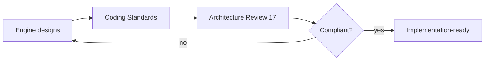

# Sprint 5 — 16 · Brain Coding Standards (Architectural)

> Status: **ARCHITECTURE DRAFT** · Scope: design-time standards that a future implementation
> sprint must follow. No code is produced here.

## Purpose

Set the non-negotiable engineering principles that keep the Brain provider-agnostic, replaceable,
observable, and scalable — so implementation, whenever authorized, cannot drift from the
architecture.

## Principles

1. **Boundary purity.** No vendor SDK, model name, or transport concept may appear inside the
   Brain. Providers are reached only through ports (14).
2. **Interface-first.** Every engine is consumed through a small, versioned capability contract.
   Consumers depend on the contract + version, never on internals.
3. **Determinism & reproducibility.** Given the same inputs and config/engine versions, the
   orchestration path is reproducible. Randomness is explicit and seeded via a port.
4. **Statelessness of compute.** Engines hold no hidden global mutable state; all state is
   externalized via the Store Port, keyed by relationship/session.
5. **Graceful degradation.** Every dependency may be absent; each engine defines a documented
   default and marks the trace as degraded rather than failing the turn.
6. **Safety is mandatory.** No output path may bypass the Safety Layer. Safety fails **closed**.
7. **Observability by default.** Every significant action emits a Brain Event with enough context
   to trace a decision end-to-end.
8. **Single-writer discipline.** Per-session state transitions and memory writes are serialized
   per key; writes are idempotent.
9. **Additive versioning.** Contracts evolve backward-compatibly; breaking changes require a new
   version, never silent mutation.
10. **No business logic in cognition.** Billing, auth, and product rules live outside the Brain.
11. **Untrusted-by-default input.** All user input and all retrieved memory/knowledge/tool output
    is trust-tagged (18) and rendered as data, never as instructions. Nothing persists to memory
    without passing the Memory-Write Validation Gate (04/18).
12. **Budgeted execution.** Every turn runs under token/cost/time budgets granted by the
    Cost/Latency Controller (20); no engine may consume unbounded resources.
13. **Central retry policy.** Retries, backoff, and circuit-breaking are defined once in 20 and
    reused everywhere; no engine invents its own ad-hoc retry loop.
14. **Traceability.** Every engine propagates the trace id (14) and stamps its events with it, so
    any decision is reconstructable end-to-end.

## Responsibilities (of implementers, when unlocked)

- Enforce boundary purity in CI (reject vendor imports inside the Brain).
- Provide a default/fallback for every port dependency.
- Emit events at every stage boundary defined in 09.
- Pin behavior to config + engine versions in every response trace.

## Inputs / Outputs

- **Input to the standard:** each engine's design (03–13).
- **Output:** review criteria used in 17-Brain-Review and future PR reviews.

## Dependencies

- 14 (Contracts) for interface rules; 13 (Safety) for the mandatory checkpoint.

## Data Flow (governance)

## Failure Cases (process)

- A design that cannot degrade gracefully → not implementation-ready.
- A contract without a version → rejected.
- An engine reaching a provider directly → rejected.

## Future Scaling

- Standards become automated fitness functions (CI checks) once implementation begins.
- Per-engine conformance test suites validate contract adherence.

## Interfaces

- These standards are the acceptance criteria referenced by 17 and by future implementation PRs.

## Related Documents

14 (Contracts) · 13 (Safety) · 15 (Folder Structure) · 17 (Review).
