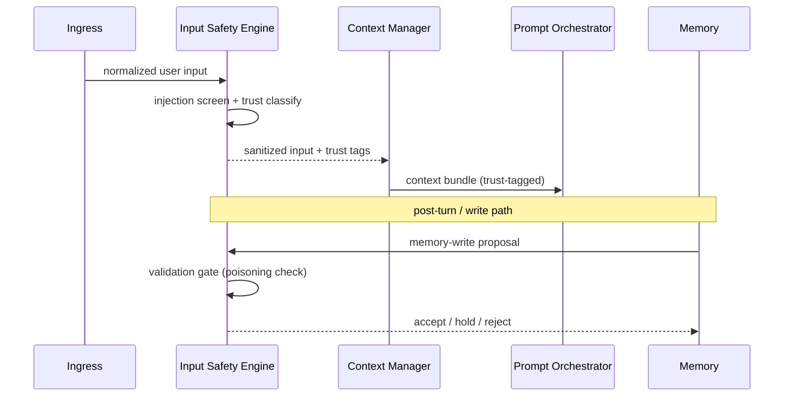

# Sprint 5 — 18 · Input Safety & Prompt Injection Architecture

> Status: **ARCHITECTURE DRAFT** · Scope: design only. No implementation authorized.

## Purpose

Guard the Brain against hostile, malformed, or manipulative input **before** it can influence
cognition, memory, or generation. Where the Safety Layer (13) governs what leaves the Brain, the
**Input Safety Engine** governs what is allowed *in* and what is allowed to *persist*. It closes
the two named-but-previously-undesigned threats: **prompt injection** and **memory poisoning**.

This engine sits at the very front of the turn and again on the memory-write path, so that no
untrusted content — whether typed by a user, recalled from memory, or returned by a tool or
knowledge source — can silently become an instruction to the model.

## Threat Model

| Threat | Vector | Defense owned here |
|--------|--------|--------------------|
| Direct prompt injection | User input contains "ignore previous instructions…" | Ingress screening + instruction/content separation |
| Indirect (RAG) injection | Retrieved memory/knowledge/tool output carries hidden instructions | Provenance tagging + untrusted-content quarantine before prompt assembly |
| Memory poisoning | User asserts false "facts" that persist and later ground answers | Memory-Write Validation Gate (see 04) |
| Jailbreak / role-escape | Attempts to override persona, safety, or identity boundaries | Boundary pre-check shared with 05/13 |
| Exfiltration prompt | Input designed to make Aura reveal system prompt/other users' data | Isolation + egress redaction (13) reinforcement |
| Oversized / malformed payload | Contract abuse, token flooding | Ingress validation + budget rejection (20) |

## Trust Zones

```mermaid
flowchart LR
  subgraph Untrusted
    U[User input]
    RET[Retrieved memory/knowledge]
    TOOLOUT[Tool output]
  end
  U --> ISE[Input Safety Engine]
  RET --> TAG[Provenance + trust tagging]
  TOOLOUT --> TAG
  ISE -->|sanitized + classified| CM[Context Manager]
  TAG -->|marked untrusted| CM
  ISE -. incident .-> EB([Event Bus])
```

All content carries a **trust level** (`system` > `trusted-memory` > `user` > `untrusted-external`).
The Prompt Orchestrator (10) must render lower-trust content as **data**, never as instructions.

## Responsibilities

- **Screen ingress:** inspect normalized user input for injection patterns, role-escape attempts,
  and disallowed intents before the Context Manager runs.
- **Classify & tag trust:** attach a trust level and provenance to every content item entering
  cognition, including recalled memory, grounded knowledge, and tool output.
- **Quarantine untrusted content:** ensure untrusted content is delivered to the Orchestrator as
  inert data with explicit "treat-as-content-not-instruction" markers.
- **Gate memory writes:** validate every memory-write proposal (see 04 Memory-Write Validation
  Gate) so poisoned or contradictory "facts" cannot silently persist.
- **Escalate:** emit incident events and, for high-severity cases, force a safe decision path.
- **Stay provider-agnostic:** all classification runs behind a port; no vendor filter leaks in.

## Inputs

- Normalized `BrainRequest` user input (from ingress).
- Retrieved items and their sources (from Memory 04 / Knowledge 12) prior to prompt assembly.
- Memory-write proposals (from Decision 07 / Reflection 19).
- Configuration (injection policy version, trust thresholds, quarantine rules).

## Outputs

- **Screened input verdict:** allow / sanitize / quarantine / reject, with reason codes.
- **Trust-tagged content items** for the Context Manager and Orchestrator.
- **Memory-write validation verdict:** accept / hold-for-review / reject, with reason codes.
- Input-safety incident events for audit and Reflection.

## Dependencies

- Context Manager (08), Prompt Orchestrator (10), Safety Layer (13), Memory (04),
  Configuration/Versioning (03), Event Bus (03). Classification via a Safety-Classifier Port.

## Data Flow

## Failure Cases

- Input Safety Engine unavailable → **fail closed**: treat input as untrusted, run a minimal
  safe path (personality + Safety Layer only), and skip memory writes for the turn.
- Ambiguous injection verdict → escalate to the most restrictive action (quarantine).
- Policy version unknown → reject the turn at ingress rather than screen with an unknown policy.
- Validation gate uncertain about a write → **hold-for-review** (never auto-persist).

## Future Scaling

- Layered classifiers (fast heuristic pre-filter + deep classifier) behind one verdict contract.
- Per-locale/jurisdiction injection policy packs as configuration versions.
- Feedback loop: confirmed incidents refine thresholds via Reflection (19) telemetry.
- Shared trust-tagging fabric reused by multimodal inputs when they arrive.

## Interfaces (contracts, not code)

- **Screen-input:** accepts (normalized input, policy version) → returns verdict + trust tags.
- **Tag-content:** accepts (item, source) → returns item with trust level + provenance.
- **Validate-write:** accepts a memory-write proposal → returns accept / hold / reject + reason.

## Related Documents

04 (Memory / Write Gate) · 08 (Context) · 10 (Orchestrator) · 12 (Knowledge/Tools) ·
13 (Safety) · 19 (Reflection) · 14 (Contracts).
