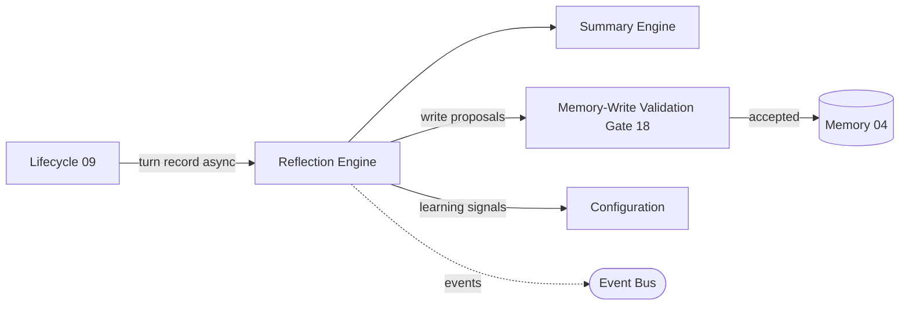

# Sprint 5 — 19 · Reflection Engine

> Status: **ARCHITECTURE DRAFT** · Scope: design only. No implementation authorized. This
> document promotes the Reflection Engine (previously summarized in 04 and 17·§C) to a
> first-class engine, symmetric with every other engine doc.

## Purpose

Turn each completed turn into durable learning **without touching the live path**. The Reflection
Engine is the Brain's off-path memory-maker and self-improver: it consolidates conversations into
memory, distills durable facts, updates the relationship and preference models, and feeds quality
and safety telemetry back to Configuration. It is the only engine allowed to *propose* long-term
change, and it never blocks a response.

## Responsibilities

- **Consolidate:** summarize the turn (via the Summary Engine, 04) and fold it into Conversation,
  Episodic, and Long-Term memory tiers.
- **Distill:** extract durable facts, preferences, and goals from the turn record.
- **Update models:** refresh Relationship and Preference memory (bond, tone, milestones).
- **Propose, never persist directly:** every write goes through the Memory-Write Validation Gate
  (04 / 18) so reflection cannot introduce poisoned or contradictory facts.
- **Learn:** emit quality/safety/latency signals for Configuration and evaluation.
- **Stay off-path:** run fully asynchronously; failure is retried and never affects the turn.

## Inputs

- The async **turn record** from the Conversation Lifecycle (09): request references, decision,
  response, safety verdict, tool outcomes, degraded flags, and trace id.
- Prior memory state (via the Memory facade, 04).
- Configuration (reflection policy version, consolidation thresholds).

## Outputs

- **Memory-write proposals** (facts, preferences, goals, summaries) — each validated before persist.
- **Consolidation events** (what was folded, promoted, or demoted between tiers).
- **Learning signals** (response quality, safety incidents, latency/cost) to Configuration and
  the evaluation surface.

## Dependencies

- Memory (04) + Summary Engine, Input Safety / Write Gate (18), Event Bus (03),
  Configuration/Versioning (03), Clock Port. All provider-agnostic.

## Data Flow

## Failure Cases

- Reflection failure → retried with backoff per the Retry Policy (20); **never** blocks or
  corrupts the live turn. After max retries, the turn record is dead-lettered for later replay.
- Write proposal rejected by the gate (18) → discarded with an incident event; no silent persist.
- Duplicate turn record (redelivery) → idempotent by turn/trace id; consolidation applied once.
- Summary low-confidence → keep raw record + flag; do not fabricate a summary.

## Future Scaling

- Batched cross-relationship consolidation on offline compute, decoupled from live traffic.
- Model-assisted distillation swapped behind the same proposal contract.
- Scheduled decay/promotion passes coordinated with Memory Retention Policy (04).
- Global learning aggregates (privacy-preserving) feeding evaluation and Configuration.

## Interfaces (contracts, not code)

- **Reflect:** accepts a turn record → returns validated memory proposals + learning signals.
- **Consolidate:** accepts a batch of turn records for a relationship → returns tier updates.
- **Emit-learning:** accepts outcome metrics → publishes learning signals to Configuration.

## Related Documents

04 (Memory) · 09 (Lifecycle) · 18 (Input Safety / Write Gate) · 20 (Cost/Latency, Retry) ·
03 (Event Bus/Config) · 14 (Contracts).
