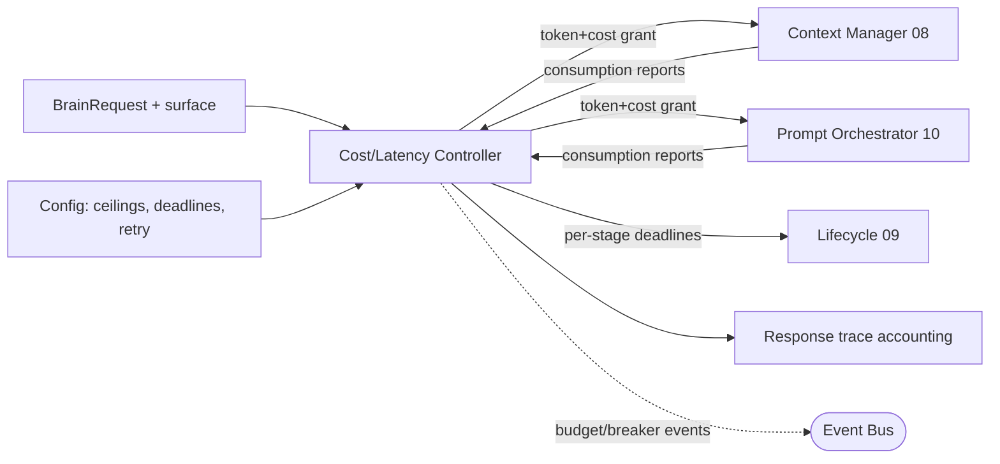

# Sprint 5 — 20 · Cost, Token Budget & Latency Controller

> Status: **ARCHITECTURE DRAFT** · Scope: design only. No implementation authorized.

## Purpose

Own the Brain's **budgets in three currencies — money, tokens, and time — and the retry policy**
that governs how the Brain spends them under failure. Individual engines request work; this
controller decides how much they may consume, enforces per-turn and per-user ceilings, and
degrades gracefully when a budget is exhausted. It makes cost and latency first-class, inspectable
facts rather than emergent side effects, which is mandatory at 10M-user scale.

## Scope of Control

| Currency | Enforced ceiling | Owner action when exceeded |
|----------|------------------|-----------------------------|
| **Money (cost)** | Per-turn, per-user/day, per-surface | Downgrade model tier / trim context / safe fallback |
| **Tokens** | Prompt-in + completion-out per turn | Deterministic context trim (08) + shorter generation |
| **Latency (time)** | Per-stage deadline + total turn deadline | Skip optional stages, return partial/degraded response |

## Responsibilities

- **Token budgeting:** allocate a per-turn token budget to the Context Manager (08) and Prompt
  Orchestrator (10); enforce prompt-in and completion-out limits via the Model Port.
- **Cost control:** track spend per turn/user/surface against configured ceilings; select model
  tier by remaining budget; block or downgrade when a ceiling is hit.
- **Latency control:** own the per-stage deadline budget referenced by the Lifecycle (09); when a
  stage misses its deadline it is skipped with a documented default and a degraded flag.
- **Retry policy ownership:** define the single, central backoff/retry/circuit-breaker policy that
  every engine and port uses (replacing scattered ad-hoc retries in 04/10/19).
- **Account & emit:** attach a per-turn cost/token/latency accounting record to the response trace
  and emit budget events for observability and Reflection (19).

## Retry Policy (single source of truth)

| Concern | Rule |
|---------|------|
| Backoff | Exponential with jitter; max attempts per port defined in Configuration |
| Idempotency | Retries require an idempotency key (turn/trace id) so no double side effects |
| Deadline-aware | A retry is only attempted if it can complete within the remaining turn deadline |
| Circuit breaker | Repeated port failures open the breaker → immediate fallback path |
| Non-retryable | Contract/validation/safety rejections are never retried |

## Inputs

- `BrainRequest` surface + config version (budget profile per surface: voice vs text).
- Live consumption reports from engines/ports (tokens used, cost incurred, elapsed time).
- Configuration (ceilings, model-tier map, deadline budgets, retry parameters).

## Outputs

- **Budget grants** to Context Manager and Orchestrator (token/cost/time allowances).
- **Deadline signals** per stage to the Lifecycle.
- **Accounting record** (cost, tokens, latency) in the response trace.
- Budget/breaker events for observability.

## Dependencies

- Context Manager (08), Prompt Orchestrator/Generator (10), Model Port, Clock Port,
  Configuration/Versioning (03), Event Bus (03).

## Data Flow

## Failure Cases

- Token budget exhausted mid-assembly → deterministic trim (08) then generate within the residual.
- Cost ceiling hit → downgrade model tier; if none available, return safe deterministic fallback.
- Total turn deadline exceeded → return the best partial/degraded response produced so far.
- Controller unavailable → apply conservative default budgets (fail safe, not unbounded) so a
  runaway turn can never occur.
- Circuit breaker open on Model Port → immediate fallback path; no retries.

## Future Scaling

- Adaptive budgets learned from Reflection (19) telemetry per surface and user segment.
- Priority classes (interactive vs background) with separate ceilings.
- Regional cost maps and locality-aware model routing behind the Model Port.
- Predictive latency shedding: skip low-value optional stages under load.

## Interfaces (contracts, not code)

- **Grant-budget:** accepts (surface, config version) → returns token/cost/time allowances.
- **Report-consumption:** accepts (stage, tokens, cost, elapsed) → updates remaining budget.
- **Retry-decision:** accepts (attempt, error class, remaining deadline) → returns retry / stop.
- **Account:** returns the per-turn cost/token/latency record for the trace.

## Related Documents

08 (Context/Budget) · 09 (Lifecycle/Deadlines) · 10 (Orchestrator) · 19 (Reflection) ·
03 (Config/Event Bus) · 14 (Contracts).
